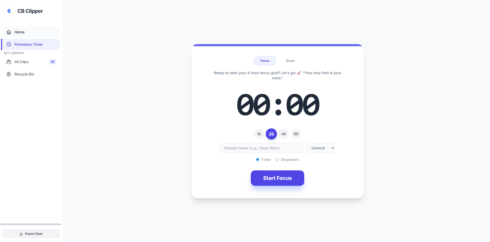
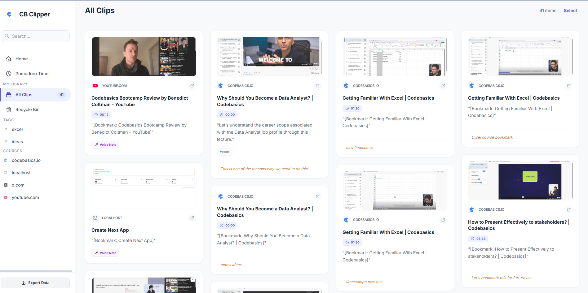

<<<<<<< HEAD
# cb-clipper-chrome-extension
=======
# CB Clipper - Browser Extension

A Chrome extension that lets you capture, organize, and retrieve highlighted text, bookmarks, screenshots, and video timestamps from any web page.

## Use Case

CB Clipper is built for learners and researchers who consume content across the web and need a fast way to save and revisit what matters.

**The problem:** When watching a tutorial, reading an article, or browsing documentation, you find something worth saving. You either copy-paste it into a notes app (losing context), take a screenshot (unsearchable), or bookmark the page (but can't find the exact section later).

**What CB Clipper does:**
- **Highlight any text** on a web page and save it as a "clip" with one shortcut (`Ctrl+Shift+S`)
- **Capture video timestamps** automatically when clipping from video pages (YouTube, Gumlet, Mux, etc.) so you can jump back to the exact moment
- **Attach notes and voice memos** to clips for added context
- **Tag and organize** clips for easy retrieval
- **Take screenshots** alongside text clips
- **Bookmark pages** even without selecting text
- **Revisit clips** and get scrolled to the exact highlighted section on the original page
- **Track learning streaks** and focus sessions with a built-in Pomodoro timer

The extension lives as a sidebar on every page, so your clips are always one click away.

## Screenshots

### Dashboard Home
Track your learning streak, daily focus time, activity calendar, and quick links — all in one place.


### Pomodoro Timer
Built-in focus timer with configurable durations (15/25/45/60 min), session naming, and stopwatch mode.



### Clips Library
Browse all your saved clips as visual cards with screenshots, source info, and tags. Filter by source or search by text.



## Features

| Feature | Description |
|---|---|
| Text Clipping | Select text on any page and save it with full context (URL, title, favicon, DOM path) |
| Video Timestamps | Automatically detects video players (HTML5, Gumlet, Mux, HLS) and captures the current playback time |
| Screenshots | Optional screenshot capture included with each clip |
| Voice Notes | Record audio memos attached to clips via the browser microphone |
| Notes & Tags | Add text notes and comma-separated tags for organization |
| Clip Restore | Click a saved clip to return to the original page and auto-scroll to the highlighted section |
| Sidebar Panel | Floating sidebar injected into every page showing recent clips, stats, and timer |
| Popup Panel | Quick-access popup from the extension icon showing recent clips and timer controls |
| Focus Timer | Pomodoro-style timer (focus + break modes) with session logging |
| Stopwatch | Stopwatch mode for open-ended tracking |
| Streak Tracking | Tracks consecutive daily visits to codebasics.io |
| Dashboard | Full-featured React dashboard for browsing, searching, filtering, and managing all clips |
| Context Menu | Right-click "Save to CB Clipper" on selected text |
| Keyboard Shortcut | `Ctrl+Shift+S` (Windows) / `Cmd+Shift+S` (Mac) to capture |

## Installation

1. Download and unzip `CBClipper.zip`
2. Open Chrome and go to `chrome://extensions/`
3. Enable **Developer mode** (toggle in the top-right corner)
4. Click **Load unpacked**
5. Select the unzipped `extension` folder
6. The CB Clipper icon will appear in your toolbar

## How to Use

1. **Capture a clip:** Select text on any page and press `Ctrl+Shift+S`, or right-click and choose "Save to CB Clipper"
2. **Add context:** In the capture modal, add a note, record a voice memo, add tags, and toggle screenshot inclusion
3. **View clips:** Click the floating sidebar button (right edge of page) or the extension popup icon
4. **Open Dashboard:** Click "Open Dashboard" from the sidebar or popup to see all clips with search, filter, and management
5. **Revisit a clip:** Click any clip to open the original page - the extension auto-scrolls to the highlighted section
6. **Use the timer:** Start a Focus (25m) or Break (5m) session from the popup or sidebar

## Architecture

```
extension/
|-- manifest.json          # Chrome Extension Manifest V3 configuration
|-- background.js          # Service worker: timer logic, clip save/retrieve, context menus, streak tracking
|-- content.js             # Content script: sidebar injection, capture modal, text selection, video detection, clip restore
|-- content.css            # Styles for sidebar widget, capture modal, and highlight overlay
|-- idb-helper.js          # IndexedDB wrapper: CRUD operations for clips storage
|-- popup.html             # Extension popup UI (toolbar icon click)
|-- popup.js               # Popup logic: recent clips list, stats display, timer controls
|-- sidebar.html           # Sidebar panel UI (injected iframe)
|-- sidebar.js             # Sidebar logic: clips list, stats, timer, capture button
|-- icons/                 # Extension icons (16, 48, 128px) and sidebar logo
|-- dashboard/             # Pre-built React app (Vite + Tailwind) for full clip management
    |-- index.html
    |-- assets/            # Bundled JS and CSS
    |-- logo.png
```

### How the pieces connect

```
                     +------------------+
                     |  background.js   |
                     |  (Service Worker)|
                     +--------+---------+
                              |
            +-----------------+------------------+
            |                 |                  |
    +-------v------+  +------v-------+  +-------v--------+
    |  content.js  |  |  popup.js    |  |  sidebar.js    |
    |  (Every tab) |  |  (Toolbar)   |  |  (Iframe)      |
    +--------------+  +--------------+  +----------------+
            |                 |                  |
            +--------+--------+------------------+
                     |
              +------v-------+
              | idb-helper.js|
              | (IndexedDB)  |
              +--------------+
                     |
              +------v-------+
              |  dashboard/  |
              |  (React App) |
              +--------------+
```

**background.js (Service Worker)** - The central coordinator. Handles:
- Timer state machine (start, pause, stop, alarm-based completion)
- Session logging to `chrome.storage.local`
- Saving/retrieving clips via `idb-helper.js` (IndexedDB)
- Context menu creation and keyboard shortcut handling
- Multi-frame capture orchestration (queries all frames for selection data, picks the best result)
- Streak tracking on codebasics.io navigation events

**content.js (Content Script)** - Runs on every page in all frames. Handles:
- Injecting the floating sidebar button and iframe container into the top frame
- Displaying the capture modal when a clip is triggered
- Extracting selected text, DOM path, and text offsets for later restoration
- Detecting video players (HTML5 `<video>`, Gumlet, Mux, HLS custom elements) including inside Shadow DOM
- Restoring clips by scrolling to the saved DOM path or falling back to XPath text search
- Cross-frame video seek support
- Live timer display on the sticky sidebar button

**idb-helper.js (Storage Layer)** - Shared IndexedDB wrapper used by background, popup, and sidebar. Provides:
- `addClip()` / `getClip()` / `getAllClips()` - Core CRUD
- `markClipsDeleted()` / `restoreClips()` / `deleteClipsPermanently()` - Soft delete + permanent delete
- Indexed on `url`, `capturedAt`, and `tags` for fast queries

**popup.js / sidebar.js (UI Layers)** - Near-identical logic for two different surfaces:
- Display recent clips with preview, hostname, and timestamp
- Show streak count and today's focus time from `chrome.storage.local`
- Embedded Pomodoro timer with start/pause/stop controls
- Navigation to the full dashboard

**dashboard/ (React App)** - A Vite + Tailwind CSS single-page app bundled into the extension. Opens as a new tab for full clip management with search, filtering, and bulk operations.

### Data Storage

| Data | Storage | Why |
|---|---|---|
| Clips (text, notes, tags, screenshots, voice notes) | IndexedDB (`CBClipper` database) | Large payloads (screenshots, audio) exceed `chrome.storage` limits |
| Timer state | `chrome.storage.local` | Needs to be reactive across popup, sidebar, and content script via `onChanged` listener |
| Streak data | `chrome.storage.local` | Small payload, needs cross-context access |
| Activity log (daily visits, focus/break seconds, sessions) | `chrome.storage.local` | Aggregated daily stats, small payload |

### Key Design Decisions

- **Manifest V3** with a service worker instead of a persistent background page
- **All-frames content script** so video timestamps can be captured from embedded iframes (e.g., Gumlet player inside a course page)
- **Multi-frame capture**: background.js uses `chrome.scripting.executeScript` with `allFrames: true` to query every frame, then picks the best selection and video timestamp
- **Soft delete**: Clips are marked `isDeleted` rather than removed, allowing a trash/restore workflow
- **Sidebar as iframe**: The sidebar panel is injected as an iframe pointing to `sidebar.html`, isolating its styles and scripts from the host page
>>>>>>> 181c3f0 (cb clipper v1)
